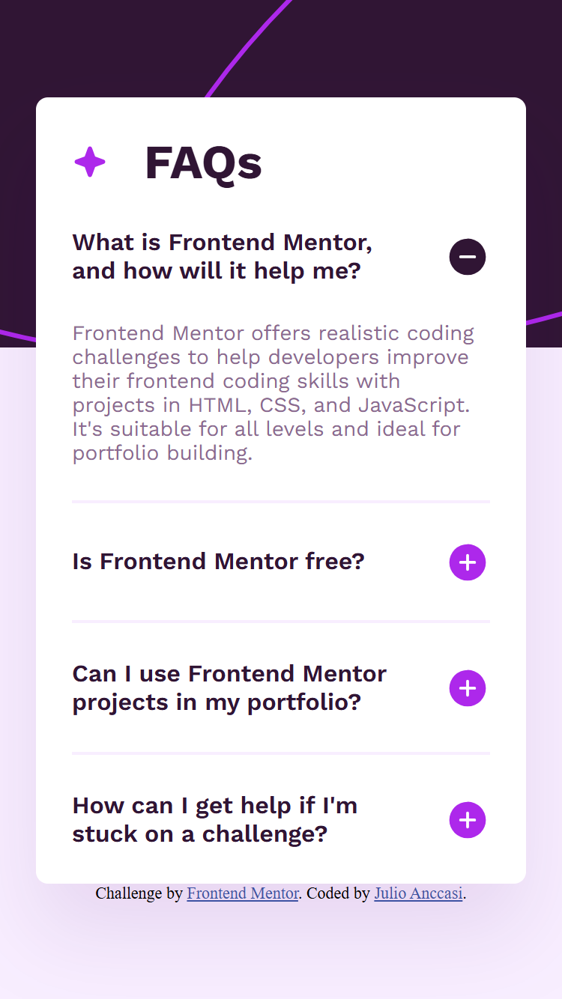
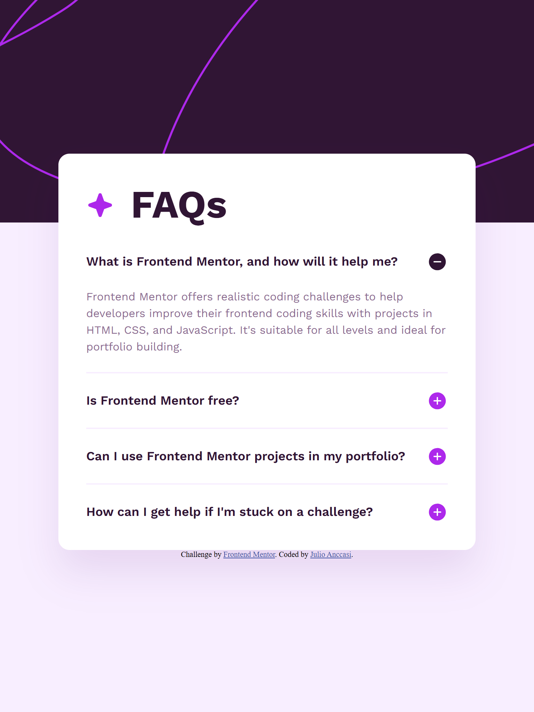
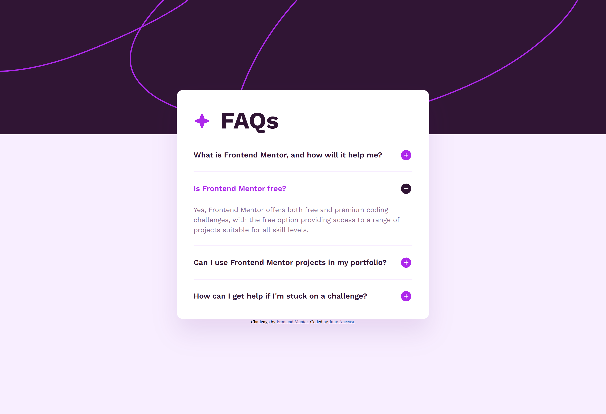

# Frontend Mentor - FAQ accordion solution

This is a solution to the [FAQ accordion challenge on Frontend Mentor](https://www.frontendmentor.io/challenges/faq-accordion-wyfFdeBwBz). Frontend Mentor challenges help you improve your coding skills by building realistic projects.

## Table of contents

- [Frontend Mentor - FAQ accordion solution](#frontend-mentor---faq-accordion-solution)
  - [Table of contents](#table-of-contents)
  - [Overview](#overview)
    - [The challenge](#the-challenge)
    - [Screenshot](#screenshot)
    - [Links](#links)
  - [My process](#my-process)
    - [Built with](#built-with)
    - [What I learned](#what-i-learned)
    - [Continued development](#continued-development)
    - [Useful resources](#useful-resources)
  - [Author](#author)

## Overview

### The challenge

Users should be able to:

- Hide/Show the answer to a question when the question is clicked
- Navigate the questions and hide/show answers using keyboard navigation alone
- View the optimal layout for the interface depending on their device's screen size
- See hover and focus states for all interactive elements on the page

### Screenshot





### Links

- Solution URL: [https://github.com/ChechiX/faq-accordion](https://github.com/ChechiX/faq-accordion)
- Live Site URL: [https://chechix.github.io/faq-accordion/](https://chechix.github.io/faq-accordion/)

## My process

### Built with

- Semantic HTML5 markup
- Flexbox
- Mobile-first workflow
- [Sass](https://sass-lang.com/) - For styles

### What I learned

I learned that using the correct labels makes keyboard navigation much easier.

```html
<details class="faq__details" open name="question">
  <summary class="faq__summary">
    What is Frontend Mentor, and how will it help me?
  </summary>
  <p class="faq__answer">
    Frontend Mentor offers realistic coding challenges to help developers
    improve their frontend coding skills with projects in HTML, CSS, and
    JavaScript. It's suitable for all levels and ideal for portfolio building.
  </p>
</details>
```

### Continued development

I need to keep building web pages with the correct tags so that keyboard navigation is implemented automatically.

### Useful resources

- [Exclusive accordions using the HTML details element](https://developer.mozilla.org/en-US/blog/html-details-exclusive-accordions/) - This article helped me understand how to use the details element to create an accordion.

## Author

- Frontend Mentor - [@ChechiX](https://www.frontendmentor.io/profile/ChechiX)
